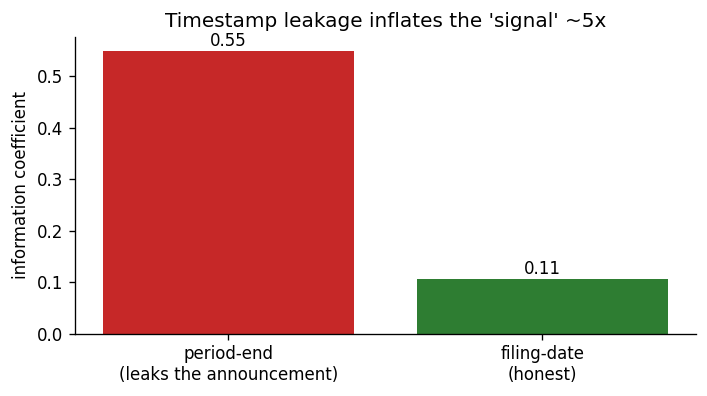
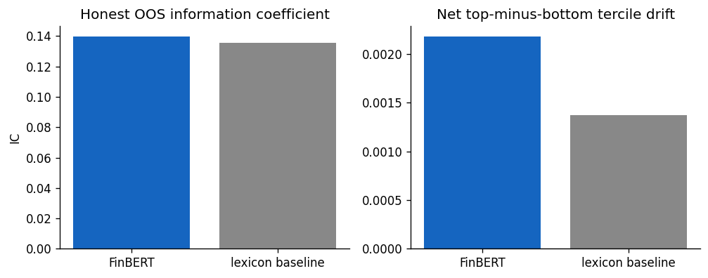

## The research question

Company filings carry **tone**. The hopeful pitch: a transformer (FinBERT) reads that tone
and predicts returns better than a crude word list.

The disciplined question is narrower:

> Does FinBERT's tone predict the drift **after the filing is public**, better than a simple
> lexicon, **once we respect the timestamp and pay costs**?

*Everything hinges on those last two conditions.*

## The data (and the planted truth)

Reproducible **synthetic filings** (a stand-in for SEC EDGAR — runs offline, fixed seed).
Each filing has a latent tone, and two returns follow it:

- an **announcement** jump at the filing date — strongly tone-driven, and *untradeable*
  before the filing is public;
- a faint **post-filing drift** over the next 20 days — weakly tone-driven, and the only
  genuinely tradeable target.

The filing is dated **45 days after** the period it describes. That gap is where projects
go to die.

## Two readers of the text

- **Baseline** — a shallow Loughran–McDonald-style lexicon: net (positive − negative) hits.
  Cheap, transparent, hard to beat.
- **Model** — **FinBERT** (a finance-tuned transformer). The question is whether its
  semantic reading earns its complexity.

*Rule of the road: you have to beat the baseline out of sample before the transformer counts
for anything.*

## The leakage trap

Align tone to the **period-end** date and the return window swallows the announcement pop —
a move you could never have traded. Align to the **filing date** and you keep only the
honest, post-public drift.

The same model, the same text — **~5× the "signal," entirely from the wrong timestamp.**

## Honest, time-aware evaluation

Evaluate out of sample (never shuffle time). Compare the **information coefficient** and a
top-minus-bottom **tercile spread**, net of a 10 bp cost.

## The result

- Removing the timestamp leak cuts the apparent signal by **~5×**.
- On the honest target, FinBERT's edge is **small, fragile, and does not clearly beat the
  lexicon**.
- The transformer's fluency buys little once the untradeable announcement return is removed
  and costs are charged.

**This is a good negative result** — the disciplined finding is that the easy "NLP alpha"
was mostly leakage.

## Limitations

- **Synthetic data** — real filings are noisier; the honest IC on EDGAR text is usually
  *smaller*, not larger.
- **One universe, one horizon** — no sector/size controls, a single tercile cut.
- **Stylized 10 bp cost** — a filing-clustered strategy would likely pay more impact.
- **No multiple-testing accounting** — a real model/lexicon/horizon search needs a deflated
  Sharpe and a trial count.

## Takeaway

The question was never *"is FinBERT fluent?"*

It is *"does its tone predict a return you could actually have traded, after costs?"*

Here — **barely.** And that answer, honestly arrived at, is the assignment.
